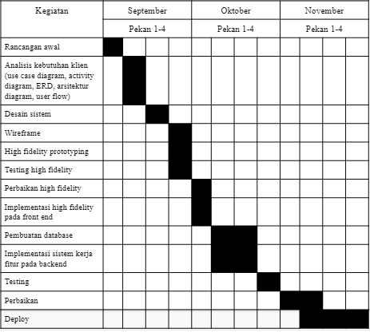

# MyVoucher

### Nama Anggota Kelompok 7 Responsi 1 :
| Nama               | NIM           |
|--------------------|---------------|
| M Naufal Abdillah  | **G64180016** |
| Tia Isnawati Noor  | **G64180034** |
| Rafi Solichin      | **G64180068** |
| Hudzaifah Muttaqin | **G64180119** | 

## Latar Belakang 

   	Loyalitas dari pengguna merupakan hal yang patut untuk dihargai. Berbagai cara dilakukan oleh perusahaan untuk menjaga agar pengguna tetap setia menggunakan produk/aplikasi yang dimiliki. Kesetiaan pengguna terhadap suatu produk merupakan hal yang mesti didapatkan dari suatu penjual atau perusahaan. 

	Salah satu cara yang dilakukan oleh perusahaan untuk menghargai loyalitas dari pengguna adalah dengan memberikan promo/voucher. Reward berupa promo/voucher ini hanya diberikan kepada pengguna yang termasuk dalam kategori loyal oleh penilaian perusahaan. Sehingga dengan adanya reward berupa promo/voucher harapannya pengguna akan tetap setia dan mempunyai daya tarik lebih untuk tetap menggunakan aplikasi yang dimiliki perusahaan.

	Sistem yang akan dibuat akan berbasis web-based selama kurang lebih 3 bulan. Hasil akhir akan berupa aplikasi sederhana yang dapat digunakan.

## Deskripsi Sistem

	Aplikasi/sistem yang akan dibuat adalah aplikasi web yang bisa memungkinkan pengguna untuk mendapatkan promo dan voucher atas keloyalannya terhadap suatu produk 

## Deskripsi Kebutuhan

### Kebutuhan Fungsional
	Menampilkan fitur kode promo, cashback,  dan voucher.

### Kebutuhan Nonfungsional

	1. Perangkat Lunak:
   		a. Teks editor: Visual Studio Code
    	b. Sistem Operasi: Windows 10
    	c. Design tool: Figma
    	d. Management tool: Trello, Github, Google drive
    2. Perangkat Keras:
   		a. CPU: Intel Core i5-8250U @1.60GHz
    	b. GPU: Intel(R) UHD Graphics 620, Radeon 530 Series
    	c. RAM: 8 GB
    3. Teknologi:
   		a. Server: XAMPP
        b. Framework : Laravel

## Tabel Fitur 

| No | 	Fitur	|										Kegunaan														|
|----|----------|-------------------------------------------------------------------------------------------------------|
| 1  | Promo 	| Memberikan diskon terhadap beberapa produk dalam waktu yang terbatas									|
| 2  | Voucher 	| Keuntungan yang didapatkan pengguna berupa diskon khusus terhadap beberapa produk						|
| 3  | Cashback | Memberikan user uang kembalian sebagai reward karena telah menyelesaikan beberapa syarat sebelumnya 	|

## Metode Pengembangan   
Prototyping

## Schedule 

## Use Case Diagram 

## ER Diagram  

## Tampilan Website 

## Github 

## <a href="https://trello.com/b/VelLsfKO/mppl"> Trello </a> 

